# Linear Regression


``` r
library(MASS)
library(ISLR2)
```


    Attaching package: 'ISLR2'

    The following object is masked from 'package:MASS':

        Boston

``` r
head(Boston)
```

         crim zn indus chas   nox   rm  age  dis rad tax ptratio lstat medv
    1 0.00632 18  2.31    0 0.538 6.58 65.2 4.09   1 296    15.3  4.98 24.0
    2 0.02731  0  7.07    0 0.469 6.42 78.9 4.97   2 242    17.8  9.14 21.6
    3 0.02729  0  7.07    0 0.469 7.18 61.1 4.97   2 242    17.8  4.03 34.7
    4 0.03237  0  2.18    0 0.458 7.00 45.8 6.06   3 222    18.7  2.94 33.4
    5 0.06905  0  2.18    0 0.458 7.15 54.2 6.06   3 222    18.7  5.33 36.2
    6 0.02985  0  2.18    0 0.458 6.43 58.7 6.06   3 222    18.7  5.21 28.7

# Simple linear regression

``` r
lm_fit <- lm(medv ~ lstat, data = Boston)
```

``` r
lm_fit
```


    Call:
    lm(formula = medv ~ lstat, data = Boston)

    Coefficients:
    (Intercept)        lstat  
          34.55        -0.95  

``` r
summary(lm_fit)
```


    Call:
    lm(formula = medv ~ lstat, data = Boston)

    Residuals:
       Min     1Q Median     3Q    Max 
    -15.17  -3.99  -1.32   2.03  24.50 

    Coefficients:
                Estimate Std. Error t value Pr(>|t|)    
    (Intercept)  34.5538     0.5626    61.4   <2e-16 ***
    lstat        -0.9500     0.0387   -24.5   <2e-16 ***
    ---
    Signif. codes:  0 '***' 0.001 '**' 0.01 '*' 0.05 '.' 0.1 ' ' 1

    Residual standard error: 6.22 on 504 degrees of freedom
    Multiple R-squared:  0.544, Adjusted R-squared:  0.543 
    F-statistic:  602 on 1 and 504 DF,  p-value: <2e-16

``` r
names(lm_fit)
```

     [1] "coefficients"  "residuals"     "effects"       "rank"         
     [5] "fitted.values" "assign"        "qr"            "df.residual"  
     [9] "xlevels"       "call"          "terms"         "model"        

``` r
coef(lm_fit)
```

    (Intercept)       lstat 
          34.55       -0.95 

``` r
confint(lm_fit)
```

                2.5 % 97.5 %
    (Intercept) 33.45 35.659
    lstat       -1.03 -0.874

## Confidence intervals and prediction intervals

``` r
predict(lm_fit, data.frame(lstat = (c(5, 10, 15))),
        interval = "confidence")
```

       fit  lwr  upr
    1 29.8 29.0 30.6
    2 25.1 24.5 25.6
    3 20.3 19.7 20.9

``` r
predict(lm_fit, data.frame(lstat = (c(5, 10, 15))),
        interval = "prediction")
```

       fit   lwr  upr
    1 29.8 17.57 42.0
    2 25.1 12.83 37.3
    3 20.3  8.08 32.5

These are 95% conficence intervals for various values of `lstat`.

``` r
with(lm_fit$model, plot(lstat, medv, 
                        col = "green",
                        pch = "+"))
abline(lm_fit, lwd = 3, col = "red")
```

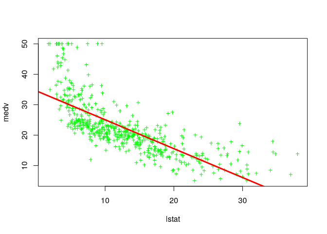

``` r
plot (1:20 , 1:20, pch = 1:20)
```

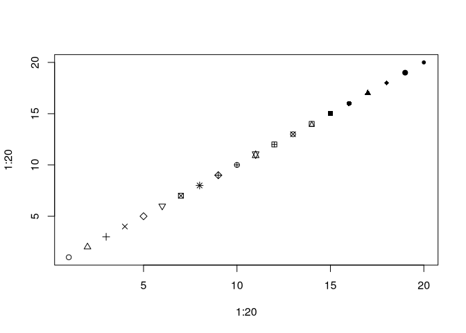

``` r
par(mfrow = c(2,2), mar = rep(2,4))
plot(lm_fit)
```

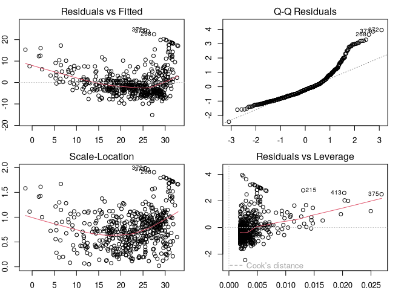

``` r
plot(predict(lm_fit), residuals(lm_fit))
```


``` r
plot(predict(lm_fit), rstudent(lm_fit))
```

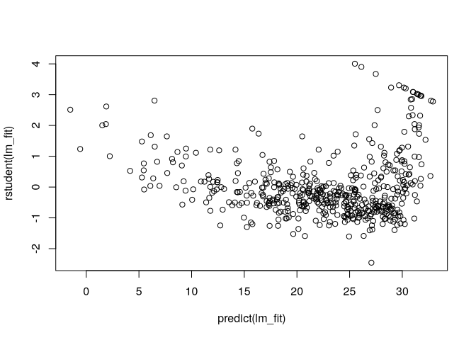

Residual plots show non-linearity. Leverage statistics:

``` r
plot(hatvalues(lm_fit))
```

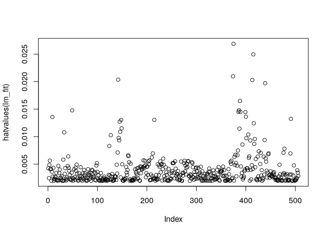

``` r
which.max(hatvalues(lm_fit))
```

    375 
    375 

# Multiple linear regression

``` r
lm_fit <- lm(medv ~ lstat + age, data = Boston)
summary(lm_fit)
```


    Call:
    lm(formula = medv ~ lstat + age, data = Boston)

    Residuals:
       Min     1Q Median     3Q    Max 
    -15.98  -3.98  -1.28   1.97  23.16 

    Coefficients:
                Estimate Std. Error t value Pr(>|t|)    
    (Intercept)  33.2228     0.7308   45.46   <2e-16 ***
    lstat        -1.0321     0.0482  -21.42   <2e-16 ***
    age           0.0345     0.0122    2.83   0.0049 ** 
    ---
    Signif. codes:  0 '***' 0.001 '**' 0.01 '*' 0.05 '.' 0.1 ' ' 1

    Residual standard error: 6.17 on 503 degrees of freedom
    Multiple R-squared:  0.551, Adjusted R-squared:  0.549 
    F-statistic:  309 on 2 and 503 DF,  p-value: <2e-16

``` r
lm_fit <- lm(medv ~ ., data = Boston)
summary(lm_fit)
```


    Call:
    lm(formula = medv ~ ., data = Boston)

    Residuals:
        Min      1Q  Median      3Q     Max 
    -15.130  -2.767  -0.581   1.941  26.253 

    Coefficients:
                 Estimate Std. Error t value Pr(>|t|)    
    (Intercept)  41.61727    4.93604    8.43  3.8e-16 ***
    crim         -0.12139    0.03300   -3.68  0.00026 ***
    zn            0.04696    0.01388    3.38  0.00077 ***
    indus         0.01347    0.06214    0.22  0.82852    
    chas          2.83999    0.87001    3.26  0.00117 ** 
    nox         -18.75802    3.85135   -4.87  1.5e-06 ***
    rm            3.65812    0.42025    8.70  < 2e-16 ***
    age           0.00361    0.01333    0.27  0.78659    
    dis          -1.49075    0.20162   -7.39  6.2e-13 ***
    rad           0.28940    0.06691    4.33  1.8e-05 ***
    tax          -0.01268    0.00380   -3.34  0.00091 ***
    ptratio      -0.93753    0.13221   -7.09  4.6e-12 ***
    lstat        -0.55202    0.05066  -10.90  < 2e-16 ***
    ---
    Signif. codes:  0 '***' 0.001 '**' 0.01 '*' 0.05 '.' 0.1 ' ' 1

    Residual standard error: 4.8 on 493 degrees of freedom
    Multiple R-squared:  0.734, Adjusted R-squared:  0.728 
    F-statistic:  114 on 12 and 493 DF,  p-value: <2e-16

``` r
summary(lm_fit)$r.sq
```

    [1] 0.734

``` r
summary(lm_fit)$sigma  # RSE
```

    [1] 4.8

``` r
library(car)
```

    Loading required package: carData

``` r
vif(lm_fit)
```

       crim      zn   indus    chas     nox      rm     age     dis     rad     tax 
       1.77    2.30    3.99    1.07    4.37    1.91    3.09    3.95    7.45    9.00 
    ptratio   lstat 
       1.80    2.87 

Remove a variable

``` r
lm_fit1 <- update(lm_fit, ~ . - age - indus)
summary(lm_fit1)
```


    Call:
    lm(formula = medv ~ crim + zn + chas + nox + rm + dis + rad + 
        tax + ptratio + lstat, data = Boston)

    Residuals:
        Min      1Q  Median      3Q     Max 
    -15.181  -2.762  -0.624   1.845  26.392 

    Coefficients:
                 Estimate Std. Error t value Pr(>|t|)    
    (Intercept)  41.45175    4.90328    8.45  3.2e-16 ***
    crim         -0.12166    0.03292   -3.70  0.00024 ***
    zn            0.04619    0.01367    3.38  0.00079 ***
    chas          2.87187    0.86259    3.33  0.00094 ***
    nox         -18.26243    3.56525   -5.12  4.3e-07 ***
    rm            3.67296    0.40913    8.98  < 2e-16 ***
    dis          -1.51595    0.18767   -8.08  5.1e-15 ***
    rad           0.28393    0.06394    4.44  1.1e-05 ***
    tax          -0.01229    0.00341   -3.61  0.00034 ***
    ptratio      -0.93096    0.13042   -7.14  3.4e-12 ***
    lstat        -0.54651    0.04744  -11.52  < 2e-16 ***
    ---
    Signif. codes:  0 '***' 0.001 '**' 0.01 '*' 0.05 '.' 0.1 ' ' 1

    Residual standard error: 4.79 on 495 degrees of freedom
    Multiple R-squared:  0.734, Adjusted R-squared:  0.729 
    F-statistic:  137 on 10 and 495 DF,  p-value: <2e-16

``` r
plot(predict(lm_fit), residuals(lm_fit))
```

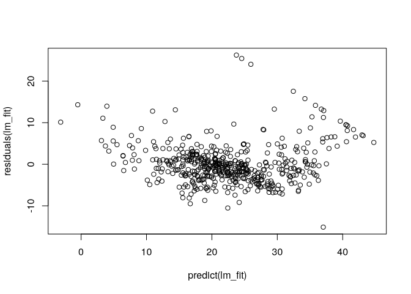

``` r
plot(predict(lm_fit1), residuals(lm_fit1))
```

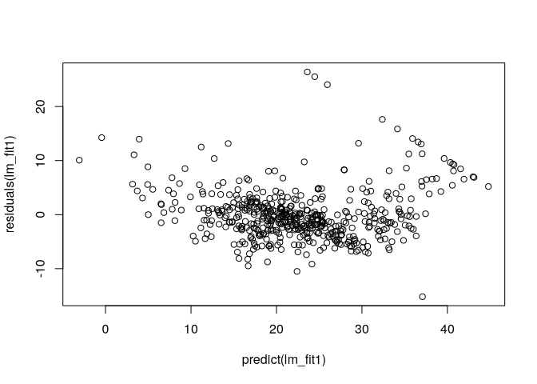

# Interaction terms

``` r
summary(lm(medv ~ lstat * age, data = Boston))
```


    Call:
    lm(formula = medv ~ lstat * age, data = Boston)

    Residuals:
       Min     1Q Median     3Q    Max 
    -15.81  -4.04  -1.33   2.08  27.55 

    Coefficients:
                 Estimate Std. Error t value Pr(>|t|)    
    (Intercept) 36.088536   1.469835   24.55  < 2e-16 ***
    lstat       -1.392117   0.167456   -8.31  8.8e-16 ***
    age         -0.000721   0.019879   -0.04    0.971    
    lstat:age    0.004156   0.001852    2.24    0.025 *  
    ---
    Signif. codes:  0 '***' 0.001 '**' 0.01 '*' 0.05 '.' 0.1 ' ' 1

    Residual standard error: 6.15 on 502 degrees of freedom
    Multiple R-squared:  0.556, Adjusted R-squared:  0.553 
    F-statistic:  209 on 3 and 502 DF,  p-value: <2e-16

# Non-linear transformations of predictors

``` r
lm_fit2 <- lm(medv ~ lstat + I(lstat^2), data = Boston)
summary(lm_fit2)
```


    Call:
    lm(formula = medv ~ lstat + I(lstat^2), data = Boston)

    Residuals:
       Min     1Q Median     3Q    Max 
    -15.28  -3.83  -0.53   2.31  25.41 

    Coefficients:
                Estimate Std. Error t value Pr(>|t|)    
    (Intercept) 42.86201    0.87208    49.1   <2e-16 ***
    lstat       -2.33282    0.12380   -18.8   <2e-16 ***
    I(lstat^2)   0.04355    0.00375    11.6   <2e-16 ***
    ---
    Signif. codes:  0 '***' 0.001 '**' 0.01 '*' 0.05 '.' 0.1 ' ' 1

    Residual standard error: 5.52 on 503 degrees of freedom
    Multiple R-squared:  0.641, Adjusted R-squared:  0.639 
    F-statistic:  449 on 2 and 503 DF,  p-value: <2e-16

compare the quadradic fit with the linear fit

``` r
lm_fit <- lm(medv ~ lstat, data = Boston)
anova(lm_fit, lm_fit2)
```

    Analysis of Variance Table

    Model 1: medv ~ lstat
    Model 2: medv ~ lstat + I(lstat^2)
      Res.Df   RSS Df Sum of Sq   F Pr(>F)    
    1    504 19472                            
    2    503 15347  1      4125 135 <2e-16 ***
    ---
    Signif. codes:  0 '***' 0.001 '**' 0.01 '*' 0.05 '.' 0.1 ' ' 1

F and p-values show the quadratic model to be far superior.

``` r
par(mfrow = c(2,2), mar = rep(1,4))
plot(lm_fit2)
```

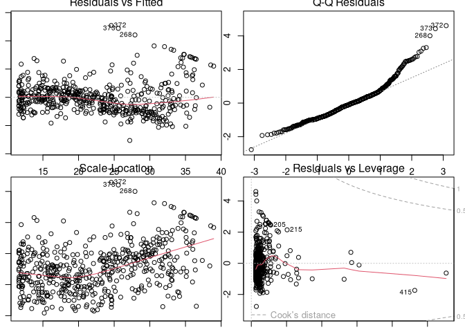

No discernable pattern in residuals

Higher order polynomials

``` r
lm_fit5 <- lm(medv ~ poly(lstat, 5), data = Boston)
lm_fit6 <- lm(medv ~ poly(lstat, 6), data = Boston)
summary(lm_fit5)
```


    Call:
    lm(formula = medv ~ poly(lstat, 5), data = Boston)

    Residuals:
        Min      1Q  Median      3Q     Max 
    -13.543  -3.104  -0.705   2.084  27.115 

    Coefficients:
                    Estimate Std. Error t value Pr(>|t|)    
    (Intercept)       22.533      0.232   97.20  < 2e-16 ***
    poly(lstat, 5)1 -152.460      5.215  -29.24  < 2e-16 ***
    poly(lstat, 5)2   64.227      5.215   12.32  < 2e-16 ***
    poly(lstat, 5)3  -27.051      5.215   -5.19  3.1e-07 ***
    poly(lstat, 5)4   25.452      5.215    4.88  1.4e-06 ***
    poly(lstat, 5)5  -19.252      5.215   -3.69  0.00025 ***
    ---
    Signif. codes:  0 '***' 0.001 '**' 0.01 '*' 0.05 '.' 0.1 ' ' 1

    Residual standard error: 5.21 on 500 degrees of freedom
    Multiple R-squared:  0.682, Adjusted R-squared:  0.679 
    F-statistic:  214 on 5 and 500 DF,  p-value: <2e-16

``` r
summary(lm_fit6)
```


    Call:
    lm(formula = medv ~ poly(lstat, 6), data = Boston)

    Residuals:
        Min      1Q  Median      3Q     Max 
    -14.732  -3.157  -0.694   2.076  26.899 

    Coefficients:
                    Estimate Std. Error t value Pr(>|t|)    
    (Intercept)       22.533      0.232   97.25  < 2e-16 ***
    poly(lstat, 6)1 -152.460      5.212  -29.25  < 2e-16 ***
    poly(lstat, 6)2   64.227      5.212   12.32  < 2e-16 ***
    poly(lstat, 6)3  -27.051      5.212   -5.19  3.1e-07 ***
    poly(lstat, 6)4   25.452      5.212    4.88  1.4e-06 ***
    poly(lstat, 6)5  -19.252      5.212   -3.69  0.00025 ***
    poly(lstat, 6)6    6.509      5.212    1.25  0.21231    
    ---
    Signif. codes:  0 '***' 0.001 '**' 0.01 '*' 0.05 '.' 0.1 ' ' 1

    Residual standard error: 5.21 on 499 degrees of freedom
    Multiple R-squared:  0.683, Adjusted R-squared:  0.679 
    F-statistic:  179 on 6 and 499 DF,  p-value: <2e-16

No improvement after $x^5$.

Not restricted to polynomials.

``` r
summary(lm(medv ~ log(rm), data = Boston))
```


    Call:
    lm(formula = medv ~ log(rm), data = Boston)

    Residuals:
       Min     1Q Median     3Q    Max 
    -19.49  -2.87  -0.10   2.84  39.82 

    Coefficients:
                Estimate Std. Error t value Pr(>|t|)    
    (Intercept)   -76.49       5.03   -15.2   <2e-16 ***
    log(rm)        54.05       2.74    19.7   <2e-16 ***
    ---
    Signif. codes:  0 '***' 0.001 '**' 0.01 '*' 0.05 '.' 0.1 ' ' 1

    Residual standard error: 6.91 on 504 degrees of freedom
    Multiple R-squared:  0.436, Adjusted R-squared:  0.435 
    F-statistic:  389 on 1 and 504 DF,  p-value: <2e-16

# Qualitative predictors

``` r
head(Carseats)
```

      Sales CompPrice Income Advertising Population Price ShelveLoc Age Education
    1  9.50       138     73          11        276   120       Bad  42        17
    2 11.22       111     48          16        260    83      Good  65        10
    3 10.06       113     35          10        269    80    Medium  59        12
    4  7.40       117    100           4        466    97    Medium  55        14
    5  4.15       141     64           3        340   128       Bad  38        13
    6 10.81       124    113          13        501    72       Bad  78        16
      Urban  US
    1   Yes Yes
    2   Yes Yes
    3   Yes Yes
    4   Yes Yes
    5   Yes  No
    6    No Yes

``` r
lm_fit <- lm(Sales ~ . + Income:Advertising + Price:Age,
             data = Carseats)
summary(lm_fit)
```


    Call:
    lm(formula = Sales ~ . + Income:Advertising + Price:Age, data = Carseats)

    Residuals:
       Min     1Q Median     3Q    Max 
    -2.921 -0.750  0.018  0.675  3.341 

    Coefficients:
                        Estimate Std. Error t value Pr(>|t|)    
    (Intercept)         6.575565   1.008747    6.52  2.2e-10 ***
    CompPrice           0.092937   0.004118   22.57  < 2e-16 ***
    Income              0.010894   0.002604    4.18  3.6e-05 ***
    Advertising         0.070246   0.022609    3.11  0.00203 ** 
    Population          0.000159   0.000368    0.43  0.66533    
    Price              -0.100806   0.007440  -13.55  < 2e-16 ***
    ShelveLocGood       4.848676   0.152838   31.72  < 2e-16 ***
    ShelveLocMedium     1.953262   0.125768   15.53  < 2e-16 ***
    Age                -0.057947   0.015951   -3.63  0.00032 ***
    Education          -0.020852   0.019613   -1.06  0.28836    
    UrbanYes            0.140160   0.112402    1.25  0.21317    
    USYes              -0.157557   0.148923   -1.06  0.29073    
    Income:Advertising  0.000751   0.000278    2.70  0.00729 ** 
    Price:Age           0.000107   0.000133    0.80  0.42381    
    ---
    Signif. codes:  0 '***' 0.001 '**' 0.01 '*' 0.05 '.' 0.1 ' ' 1

    Residual standard error: 1.01 on 386 degrees of freedom
    Multiple R-squared:  0.876, Adjusted R-squared:  0.872 
    F-statistic:  210 on 13 and 386 DF,  p-value: <2e-16

The default coding used for the dummy categorical variables

``` r
with(Carseats, contrasts(ShelveLoc))
```

           Good Medium
    Bad       0      0
    Good      1      0
    Medium    0      1

8.  This question involves the use of simple linear regression on the
    Auto data set.

<!-- -->

1)  Use the lm() function to perform a simple linear regression with mpg
    as the response and horsepower as the predictor. Use the summary()
    function to print the results. Comment on the output. For example:
    1.  Is there a relationship between the predictor and the response?
    2.  How strong is the relationship between the predictor and the
        response?
    3.  Is the relationship between the predictor and the response
        positive or negative?
    4.  What is the predicted mpg associated with a horsepower of 98?
        What are the associated 95 % confidence and prediction
        intervals?
2)  Plot the response and the predictor. Use the abline() function to
    display the least squares regression line.
3)  Use the plot() function to produce diagnostic plots of the least
    squares regression fit. Comment on any problems you see with the
    fit.

``` r
lm_fit <- lm(mpg ~ horsepower, data = Auto)
summary(lm_fit)
```


    Call:
    lm(formula = mpg ~ horsepower, data = Auto)

    Residuals:
        Min      1Q  Median      3Q     Max 
    -13.571  -3.259  -0.344   2.763  16.924 

    Coefficients:
                Estimate Std. Error t value Pr(>|t|)    
    (Intercept) 39.93586    0.71750    55.7   <2e-16 ***
    horsepower  -0.15784    0.00645   -24.5   <2e-16 ***
    ---
    Signif. codes:  0 '***' 0.001 '**' 0.01 '*' 0.05 '.' 0.1 ' ' 1

    Residual standard error: 4.91 on 390 degrees of freedom
    Multiple R-squared:  0.606, Adjusted R-squared:  0.605 
    F-statistic:  600 on 1 and 390 DF,  p-value: <2e-16

``` r
predict(lm_fit, data.frame(horsepower = 98),
        interval = "confidence")
```

       fit lwr upr
    1 24.5  24  25

``` r
predict(lm_fit, data.frame(horsepower = 98),
        interval = "prediction")
```

       fit  lwr  upr
    1 24.5 14.8 34.1

``` r
with(lm_fit$model, plot(horsepower, mpg, 
                        col = "green",
                        pch = "+"))
abline(lm_fit, lwd = 3, col = "red")
```

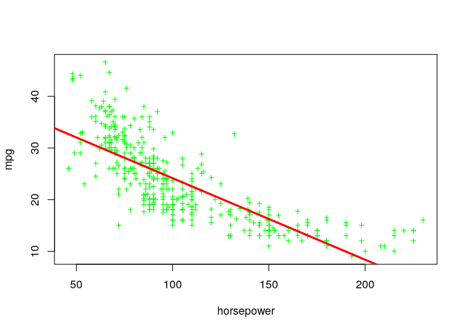

9.  This question involves the use of multiple linear regression on the
    Auto data set.

<!-- -->

1)  Produce a scatterplot matrix which includes all of the variables in
    the data set.

``` r
plot(Auto)
```

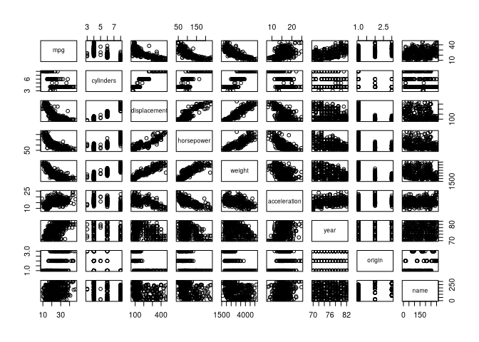

2)  Compute the matrix of correlations between the variables using the
    function cor(). You will need to exclude the name variable, cor()
    which is qualitative.

``` r
Auto |> 
  dplyr::select(-name) |> 
  cor()
```

                    mpg cylinders displacement horsepower weight acceleration
    mpg           1.000    -0.778       -0.805     -0.778 -0.832        0.423
    cylinders    -0.778     1.000        0.951      0.843  0.898       -0.505
    displacement -0.805     0.951        1.000      0.897  0.933       -0.544
    horsepower   -0.778     0.843        0.897      1.000  0.865       -0.689
    weight       -0.832     0.898        0.933      0.865  1.000       -0.417
    acceleration  0.423    -0.505       -0.544     -0.689 -0.417        1.000
    year          0.581    -0.346       -0.370     -0.416 -0.309        0.290
    origin        0.565    -0.569       -0.615     -0.455 -0.585        0.213
                   year origin
    mpg           0.581  0.565
    cylinders    -0.346 -0.569
    displacement -0.370 -0.615
    horsepower   -0.416 -0.455
    weight       -0.309 -0.585
    acceleration  0.290  0.213
    year          1.000  0.182
    origin        0.182  1.000

3)  Use the lm() function to perform a multiple linear regressionwith
    mpg as the response and all other variables except name asthe
    predictors. Use the summary() function to print the results. Comment
    on the output. For instance: i. Is there a relationship between the
    predictors and the response? ii. Which predictors appear to have a
    statistically significant relationship to the response? iii. What
    does the coefficient for the year variable suggest?

``` r
lm_fit <- lm(mpg ~ . - name, data = Auto)
summary(lm_fit)
```


    Call:
    lm(formula = mpg ~ . - name, data = Auto)

    Residuals:
       Min     1Q Median     3Q    Max 
    -9.590 -2.157 -0.117  1.869 13.060 

    Coefficients:
                  Estimate Std. Error t value Pr(>|t|)    
    (Intercept)  -1.72e+01   4.64e+00   -3.71  0.00024 ***
    cylinders    -4.93e-01   3.23e-01   -1.53  0.12780    
    displacement  1.99e-02   7.51e-03    2.65  0.00844 ** 
    horsepower   -1.70e-02   1.38e-02   -1.23  0.21963    
    weight       -6.47e-03   6.52e-04   -9.93  < 2e-16 ***
    acceleration  8.06e-02   9.88e-02    0.82  0.41548    
    year          7.51e-01   5.10e-02   14.73  < 2e-16 ***
    origin        1.43e+00   2.78e-01    5.13  4.7e-07 ***
    ---
    Signif. codes:  0 '***' 0.001 '**' 0.01 '*' 0.05 '.' 0.1 ' ' 1

    Residual standard error: 3.33 on 384 degrees of freedom
    Multiple R-squared:  0.821, Adjusted R-squared:  0.818 
    F-statistic:  252 on 7 and 384 DF,  p-value: <2e-16

``` r
lm(mpg ~ weight + year + origin, data = Auto) |> 
  summary()
```


    Call:
    lm(formula = mpg ~ weight + year + origin, data = Auto)

    Residuals:
       Min     1Q Median     3Q    Max 
    -9.944 -2.095 -0.039  1.726 13.272 

    Coefficients:
                 Estimate Std. Error t value Pr(>|t|)    
    (Intercept) -1.80e+01   4.00e+00   -4.51  8.6e-06 ***
    weight      -5.99e-03   2.54e-04  -23.59  < 2e-16 ***
    year         7.57e-01   4.83e-02   15.67  < 2e-16 ***
    origin       1.15e+00   2.59e-01    4.44  1.2e-05 ***
    ---
    Signif. codes:  0 '***' 0.001 '**' 0.01 '*' 0.05 '.' 0.1 ' ' 1

    Residual standard error: 3.35 on 388 degrees of freedom
    Multiple R-squared:  0.817, Adjusted R-squared:  0.816 
    F-statistic:  579 on 3 and 388 DF,  p-value: <2e-16

4)  Use the plot() function to produce diagnostic plots of the linear
    regression fit. Comment on any problems you see with the fit. Do the
    residual plots suggest any unusually large outliers? Does the
    leverage plot identify any observations with unusually high
    leverage?

``` r
plot(predict(lm_fit), residuals(lm_fit))
```

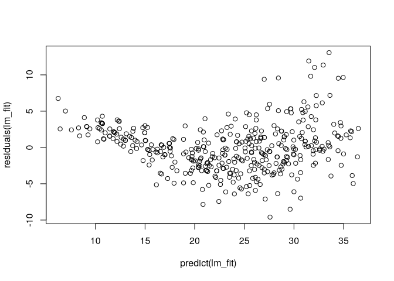

``` r
plot(hatvalues(lm_fit))
```

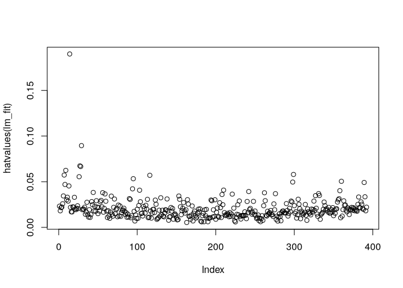

5)  Use the \* and : symbols to fit linear regression models with
    interaction effects. Do any interactions appear to be statistically
    significant?

``` r
lm(mpg ~ cylinders:year, data = Auto) |> summary()
```


    Call:
    lm(formula = mpg ~ cylinders:year, data = Auto)

    Residuals:
       Min     1Q Median     3Q    Max 
    -14.40  -3.59  -1.06   3.14  18.85 

    Coefficients:
                   Estimate Std. Error t value Pr(>|t|)    
    (Intercept)    42.48053    0.95897    44.3   <2e-16 ***
    cylinders:year -0.04602    0.00222   -20.7   <2e-16 ***
    ---
    Signif. codes:  0 '***' 0.001 '**' 0.01 '*' 0.05 '.' 0.1 ' ' 1

    Residual standard error: 5.39 on 390 degrees of freedom
    Multiple R-squared:  0.524, Adjusted R-squared:  0.522 
    F-statistic:  429 on 1 and 390 DF,  p-value: <2e-16

6)  Try a few different transformations of the variables, such as
    log(X), √X, X 2 . Comment on your findings.
